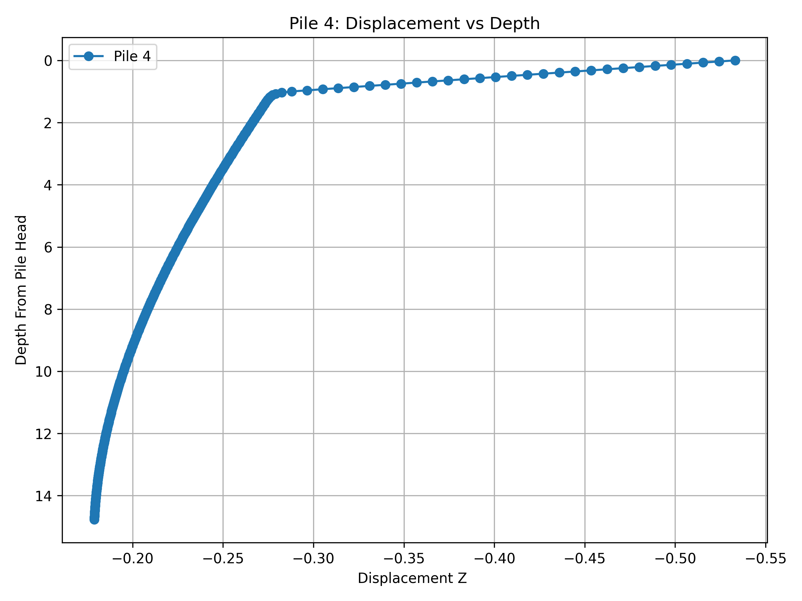
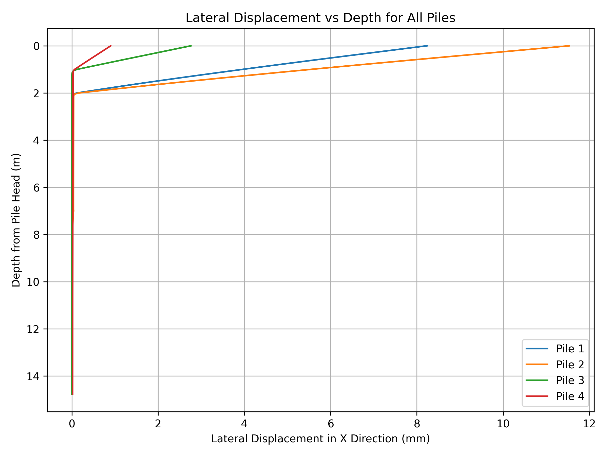

Results Analysis (Pile Analysis)
===============================================================

Download the `LatAxPileAnalysis.rspile2 <https://github.com/Rocscience/rspile-scripting/blob/main/examples/LatAxPileAnalysis.rspile2>`_ for this example.

.. _pile analysis results:
.. literalinclude:: ../../example_code/pile_analysis_data_analysis.py
   :language: python
   :caption: Code Snippet: Visualization of Pile Analysis Results

Figures
------------------

   Displacement vs Depth for Pile 4.

   Displacement vs Depth for all piles.